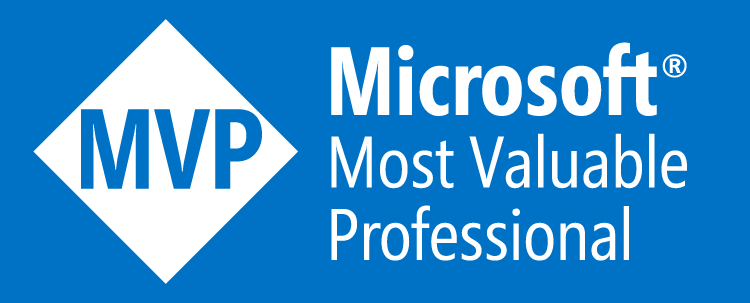

<h1 align="center">Hi there, I'm Meysam Hadeli 👋</h1>

 

  

 
 
 
  
 

 
I am a Software Architect, Open Source Developer, and Microsoft MVP in Developer Technologies with over 10 years of experience in software development. I have extensive experience in designing and implementing distributed systems and cloud-native applications using C#, .NET, Golang and Azure on top of cutting-edge technologies. I am passionate about sharing knowledge through open-source projects, blogging, public speaking and training.

<h2 align="center">🥷 Open Source Projects and Contributions</h2>

- 🪁 https://github.com/meysamhadeli/monolith-to-cloud-architecture
- 🛩️ https://github.com/meysamhadeli/booking-modular-monolith
- 🌀 https://github.com/meysamhadeli/awesome-dotnet-tips
- 🛒 https://github.com/meysamhadeli/ecommerce-monolith
- 📍 https://github.com/meysamhadeli/shop-golang-microservices
- 🤖 https://github.com/meysamhadeli/codai
- 🍿 https://github.com/meysamhadeli/problem-details
- 🛫 https://github.com/meysamhadeli/booking-microservices-express-js
- 🛬 https://github.com/meysamhadeli/booking-microservices-nestjs
- 🛸 https://github.com/meysamhadeli/booking-microservices-java-spring-boot
- 🚀 https://github.com/FastEndpoints/FastEndpoints (contributor)
- ⚡ https://github.com/dotnetcore/EasyCaching (contributor)
- ✅ https://github.com/testcontainers/testcontainers-dotnet (contributor)

 
 <strong>
  Professional skills
  </strong>

  
  
   
  
      
  
    
  
   </a>
    
  </a>
  
    
  </a>
    
  </a>
  
  
  
   

 

 
 <strong>
  Activities
  </strong>

  

